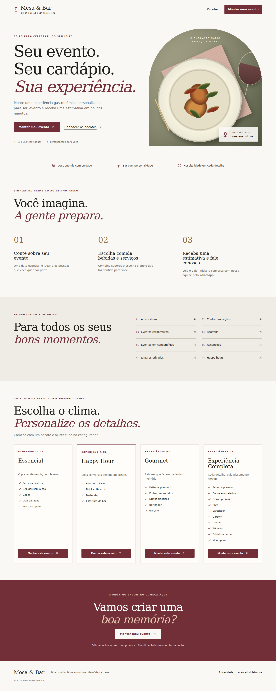

# Mesa & Bar Eventos

Plataforma de buffet, cozinha e bar para eventos de 10 a 300 pessoas. O cliente configura a experiência, vê uma estimativa e solicita atendimento pelo WhatsApp. O painel organiza leads e eventos fechados.

## Problema, solução e público-alvo

Organizar um evento costuma exigir diversas mensagens para informar local, quantidade de convidados, cardápio e equipe. O configurador reúne esses dados antes do contato comercial e oferece transparência sobre o preço inicial.

Público: pessoas organizando aniversários, jantares e recepções; empresas; condomínios; organizadores de pequenos e médios eventos.

## Tese do MVP e hipóteses

**Tese:** pessoas preferem configurar comida, bebidas e serviços, visualizar uma estimativa e somente depois conversar com o buffet.

- H1: estimativas antecipadas são valorizadas.
- H2: personalização aumenta a percepção de adequação.
- H3: pacotes reduzem a dificuldade de escolha.
- H4: estimativas imediatas aumentam solicitações.
- H5: mensagens prontas reduzem fricção comercial.

Métricas e observações: [docs/mvp-hypotheses.md](docs/mvp-hypotheses.md).

## Funcionalidades

- Landing page gastronômica, quatro pacotes e oito ocasiões.
- Configurador de seis etapas, com seleção múltipla, restrições e consentimento.
- Estimativa detalhada, equipe sugerida, quantidades editáveis e resumo.
- Persistência antes de abrir o WhatsApp; reenvio idempotente e cálculo no servidor.
- Login Supabase Auth e autorização por lista de administradores.
- Dashboard com indicadores, receita potencial e próximos eventos.
- Busca, filtros de status e período, ordenação e paginação de 25 leads.
- Detalhes, atualização de status e lembretes D−7 a D0.
- Política de privacidade, estados vazios, carregamento e falhas compreensíveis.

## Tecnologias

Next.js App Router, React, TypeScript estrito, Tailwind CSS, PostgreSQL/Supabase, Supabase Auth/SSR, Zod, React Hook Form e Lucide. Vitest, Playwright e axe-core para verificações. Versões exatas no `package-lock.json`. Node.js 22.13+ (validado com Node 24) e npm.

## Arquitetura e estrutura principal

```text
src/
  app/                 páginas, server actions e API
  components/
    event-builder/     formulário e resumo
    admin/             login, status, navegação e tabela
  config/              marca, catálogo, preços, pacotes e regras
  lib/
    pricing/           funções puras de precificação
    validation/        schema compartilhado frontend/backend
    whatsapp/          mensagem e URL codificada
    supabase/          clientes exclusivos do servidor e autorização
  types/               contratos de dados
  proxy.ts             renovação da sessão administrativa
supabase/
  migrations/          esquema e RLS
  tests/               verificação SQL de permissões
scripts/               validação isolada do PostgreSQL
tests/e2e/            fluxo público e acessibilidade
docs/                 desafio, hipóteses, teste manual e screenshots
```

Server Components carregam os dados administrativos; Server Actions autenticadas alteram status. O endpoint `POST /api/leads` valida, recalcula e persiste antes de retornar a URL do WhatsApp. Chaves privilegiadas ficam em módulos `server-only`.

### Banco de dados criado pela migração

- `leads`: contato, evento, seleções JSONB, consentimento, preço registrado, hash de idempotência, status e timestamps.
- `admin_users`: associação ao UUID do Supabase Auth; não armazena senhas.
- `app_settings`: configuração operacional persistida (`accepting_quotes`).

Um lead contém um evento. JSONB evita tabelas de itens e joins desnecessários no MVP. Ao fechar o lead, ele passa a ser considerado cliente, sem duplicação. O preço calculado fica registrado para que alterações futuras no catálogo não mudem orçamentos antigos.

Marca, regras e preços são versionados em `src/config`; não há editor administrativo de preços. Para suspender novos pedidos, altere `app_settings.accepting_quotes` para o JSON booleano `false` pelo SQL Editor. A configuração é lida em cada solicitação.

## Como executar localmente

```bash
npm ci
cp .env.example .env.local
# Preencha .env.local conforme a seção abaixo.
npm run dev
```

Acesse `http://localhost:3000`. Para produção local:

```bash
npm run build
npm start
```

Sem as variáveis, landing page, configurador e estimativa funcionam. O salvamento informa indisponibilidade e o painel não libera acesso; não existe banco fictício ou login alternativo.

## Configuração do Supabase

1. Crie um projeto Supabase dedicado.
2. Execute o conteúdo de `supabase/migrations/202610010001_initial.sql` no SQL Editor, uma única vez em banco vazio. A migração usa transação.
3. Em Authentication, desative cadastro público (`Allow new users to sign up`). Configure a URL do site para sua implantação.
4. Copie a URL, publishable key e service role key para `.env.local`. Não use a service role como chave pública.
5. Informe o WhatsApp real do buffet no formato internacional, somente dígitos, por exemplo DDI + DDD + telefone.
6. Reinicie o servidor. Variáveis `NEXT_PUBLIC_*` precisam estar definidas também no build de produção.

Referências oficiais utilizadas: [Next.js App Router](https://nextjs.org/docs/app/getting-started) e [Supabase SSR](https://supabase.com/docs/guides/auth/server-side/creating-a-client).

### Como criar o primeiro administrador

1. No dashboard Supabase, Authentication → Users → Add user, crie o usuário com e-mail e senha, com confirmação do e-mail. A senha existe apenas no Supabase Auth.
2. Copie o UUID do usuário e execute, substituindo o marcador:

```sql
insert into public.admin_users (user_id)
values ('UUID-DO-USUARIO-CRIADO-NO-AUTH');
```

3. Acesse `/admin/login`. Autenticar um usuário sem essa associação não libera o painel.

### Variáveis de ambiente

| Variável | Uso |
| --- | --- |
| `NEXT_PUBLIC_SUPABASE_URL` | URL do projeto |
| `NEXT_PUBLIC_SUPABASE_PUBLISHABLE_KEY` | Chave pública do Supabase |
| `SUPABASE_SERVICE_ROLE_KEY` | Segredo exclusivo do servidor para criação dos leads |
| `NEXT_PUBLIC_WHATSAPP_NUMBER` | Número real do buffet com DDI e DDD |
| `NEXT_PUBLIC_SITE_URL` | URL absoluta do site para metadata |

Não envie `.env.local`, senhas ou credenciais ao Git. `.env.example` contém apenas nomes vazios.

## Rotas disponíveis

| Rota | Finalidade |
| --- | --- |
| `/` | Landing page |
| `/montar-evento` | Configurador |
| `/montar-evento?pacote=happy-hour` | Exemplo de pacote selecionado |
| `/politica-de-privacidade` | Informações de privacidade |
| `/admin/login` | Login administrativo |
| `/admin` | Dashboard protegido |
| `/admin/leads` | Leads, filtros e paginação |
| `/admin/leads/[id]` | Detalhes e status |
| `POST /api/leads` | Validação e gravação do orçamento |

## Regras de preço e limitações comerciais

Os valores são **exemplos para o MVP**, sem compromisso comercial. Revise-os antes de atendimento real.

- Seleções de gastronomia e bebidas são somadas, sem descontos automáticos.
- Drinks e mocktails usam base de 3 unidades por pessoa. Selecionar 2, 4 ou 5 aplica proporção; Livre equivale a 2 vezes o valor base. Não é promessa de fornecimento ilimitado.
- Cerveja, vinho, espumante e bebidas sem álcool usam preço fixo por pessoa.
- Equipe: base até 4 horas; cada hora adicional acrescenta 25% (frações proporcionais). Alimentação e extras não variam com duração.
- Adicionais por pessoa multiplicam os convidados; itens fixos são cobrados uma vez.
- Valores não especificados no desafio foram definidos como exemplos: caipirinhas 30, gin/spritz 40, autorais 55, cerveja 25, espumante 45, vinho 40 reais por pessoa; copos 4, guardanapos 2 e gelo 3 por pessoa; mesa de apoio 150 e transporte 200 por evento.
- Sugestões: 1 bartender/40 convidados, 1 garçom/20 e 1 auxiliar/50, arredondando para cima. O cliente pode ajustar ou zerar.
- Cidade, logística e disponibilidade são analisadas no fechamento manual. A data é futura segundo o fuso America/Sao_Paulo.

## Testes e qualidade

```bash
npm run lint
npm run typecheck
npm run test
npm run build
npx playwright install --with-deps chromium
npm run test:e2e
bash scripts/test-database.sh
```

O teste de banco precisa dos binários do PostgreSQL 16 e cria um cluster temporário sem alterar bancos existentes. Simula apenas os papéis e a função `auth.uid()` para verificar RLS; não simula nem valida o serviço Supabase Auth. Os testes de API usam um adaptador de banco controlado para verificar falhas, validação, idempotência e contrato de persistência.

Os testes públicos E2E devem rodar **sem variáveis de conexão**, pois verificam também o estado de instalação não configurada. Testam larguras 360, 390, 768, 1024 e 1440 px, seleção de pacote, navegação, resultado, contraste e bloqueio administrativo.

Nesta máquina WSL, bibliotecas do Chromium já existentes foram usadas via `LD_LIBRARY_PATH=/home/mario/.local/playwright-libs/usr/lib/x86_64-linux-gnu`. Em outras instalações, use `playwright install --with-deps`.

**Limite de verificação:** a migração foi aplicada e exercitada em PostgreSQL isolado. Login real, criação de lead via Supabase hospedado e navegação autenticada no painel ainda exigem configurar um projeto real e executar [o roteiro manual](docs/manual-test.md). Não há credenciais reais incluídas.

Resultados registrados em [docs/verification.md](docs/verification.md).

## Screenshots

Capturas reais do navegador, geradas pelos testes:



[Landing mobile](docs/screenshots/landing-390.png) · [Resultado mobile](docs/screenshots/configurador-390.png)

A composição gastronômica do hero foi construída em CSS, sem imagens remotas ou bibliotecas de imagem adicionais.

## Segurança e privacidade

- RLS protege leads e configurações. Visitantes não possuem leitura ou escrita direta no banco.
- A API pública só grava após validação Zod e recalcula o total.
- Administradores podem ler leads e alterar apenas a coluna de status; não podem alterar o valor registrado pelo cliente.
- Autorização verificada no servidor em cada página/ação, além da RLS.
- Consentimento e versão do texto registrados. Nenhuma senha armazenada manualmente.
- Erros exibidos ao cliente são genéricos; logs evitam contatos e credenciais.
- Identificador e hash impedem duplicação em tentativas repetidas do mesmo envio.
- Repositório ignora variáveis reais, builds, relatórios temporários e dependências.
- O texto de privacidade deve ser revisado profissionalmente antes do uso comercial definitivo. Defina retenção e procedimento operacional de exclusão.
- O MVP não inclui proteção dedicada contra spam/rate limiting. Antes de exposição ampla, configure limites no provedor de hospedagem e monitore o volume de leads.

## O que permanece manual no MVP

Confirmação de disponibilidade, fechamento comercial, negociação, pagamento, compra de ingredientes, contratação de equipe, organização logística e confirmação final. Lembretes não enviam notificações nem registram tarefas concluídas. O objetivo é testar aquisição, configuração e intenção de compra.

## Business Model Canvas

| Dimensão | Hipótese de negócio |
| --- | --- |
| Segmentos de clientes | Eventos particulares, empresas, condomínios, organizadores, aniversários e happy hours |
| Proposta de valor | Configurar rapidamente uma experiência gastronômica e receber estimativa antes do contato comercial |
| Canais | Site, Instagram, WhatsApp e indicações |
| Relacionamento | Autoatendimento inicial e atendimento humano no fechamento |
| Fontes de receita | Buffet, bar, equipe, adicionais e pacotes |
| Recursos principais | Equipe, fornecedores, estrutura, plataforma digital e marca |
| Atividades principais | Gastronomia, coquetelaria, atendimento, logística e produção |
| Parceiros | Fornecedores, bartenders, garçons, cozinheiros, transportadores e espaços de eventos |
| Estrutura de custos | Ingredientes, bebidas, equipe, transporte, equipamentos, marketing e software |

## TAM, SAM e SOM

Não há pesquisa quantitativa validada neste projeto. Todos os valores são **hipóteses a validar**.

| Mercado | Delimitação | Pesquisa necessária |
| --- | --- | --- |
| TAM | Mercado total de eventos e serviços de alimentação | Fontes setoriais verificadas, período, geografia e metodologia |
| SAM | Eventos na região operacional do buffet | Raio de atendimento, tipos de evento e capacidade logística |
| SOM | Parcela inicialmente alcançável | Capacidade da equipe, localização, aquisição de clientes e taxa de fechamento |

Não estimar participação ou faturamento sem validar fontes e capacidade.

## Próximas evoluções

Somente após validar o MVP: Stripe, PIX, e-mail via Resend, WhatsApp API, chatbot, n8n, Google Calendar, estoque, ingredientes, CRM, relatórios, cupons, cardápios sazonais, avaliações e programa de indicação. Nenhuma dessas integrações está implementada agora.

## Processo de construção

[Pedido original](docs/mega-prompt.md), [hipóteses e métricas](docs/mvp-hypotheses.md), [teste manual](docs/manual-test.md). A documentação registra explicitamente o que foi verificado e o que depende da instalação real.
